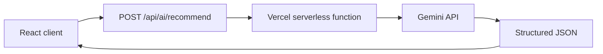
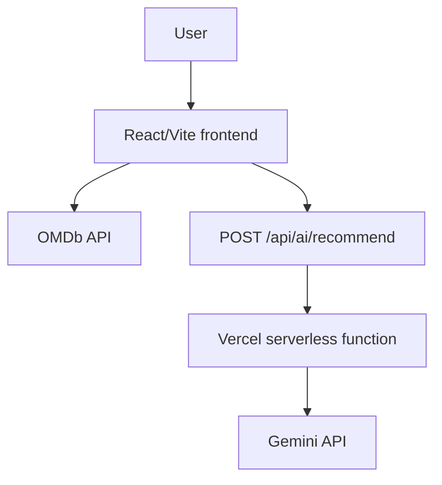

# Movie Search AI

Movie Search AI helps users search for movies and explore dedicated movie details. When a title is not enough, users can describe their mood, genre, style, or preferred kind of movie naturally and receive an AI-powered recommendation.

## Live Demo

https://movie-search-ai.vercel.app/

## Project Brief

Traditional title-based search works well when users already know what they want to watch. Movie Search AI also supports the less certain moment: it is for movie fans who know the mood, genre, style, or type of experience they want, but not a specific title. The AI Movie Assistant turns those natural-language preferences into a focused recommendation.

## Features

- Movie title search through OMDb
- Search results presented as movie cards
- Dedicated movie details pages
- AI-powered natural-language movie discovery
- Structured recommendations with a primary title, reason, genres, and alternatives
- Loading, error, and empty states
- Responsive interface
- Keyboard-friendly, accessible controls and announcements
- Production deployment on Vercel

## AI Integration

The AI request flow is intentionally server-side:



React never calls Gemini directly. The `GEMINI_API_KEY` is read only by the server-side function and must never be renamed with a `VITE_` prefix. The current model is `gemini-3.6-flash`.

The endpoint validates the request, asks Gemini for structured JSON, validates the returned shape, and then returns it to React. The UI shows a generic friendly message for AI failures instead of raw Gemini or server errors.

Logical response shape:

```json
{
  "recommendation": "Movie title",
  "reason": "Why the movie matches",
  "genres": ["Genre"],
  "alternatives": ["Alternative movie"]
}
```

## Architecture



The main project areas are:

- `src/components`: reusable layout, search, movie, AI, and UI components
- `src/pages`: home, search-results, and movie-details views
- `src/hooks`: reusable movie and AI request state
- `src/services/api`: typed OMDb and AI API clients
- `src/types`: shared TypeScript contracts
- `api`: server-side Vercel functions
- `e2e`: Playwright browser and accessibility checks

## Technology Stack

### Frontend

- Vite
- React 19
- TypeScript
- React Router
- CSS

### AI/API

- OMDb API
- Google Gemini through `@google/genai`
- Vercel serverless API functions

### Testing

- Vitest
- React Testing Library
- Playwright
- `axe-core` and `@axe-core/playwright`

### Deployment

- Vercel
- Vercel SPA rewrites through `vercel.json`

## Getting Started

Prerequisites:

- Node.js
- npm
- An OMDb API key
- A Google Gemini API key

Clone and install dependencies:

```bash
git clone <repository-url>
cd movie-search-ai
npm install
```

Create `.env` from `.env.example` and provide the required values:

```dotenv
VITE_OMDB_API_KEY=
GEMINI_API_KEY=
```

`VITE_OMDB_API_KEY` is used by the client-side OMDb integration and is client-visible by design. `GEMINI_API_KEY` is server-side only. Never rename it to `VITE_GEMINI_API_KEY`, and never commit actual secret values.

For the complete local application, including the serverless AI endpoint, run:

```bash
npx vercel dev
```

This serves the Vite frontend and `/api/ai/recommend` together. `npm run dev` runs the Vite frontend alone; the local Vercel serverless AI endpoint is not available through the plain Vite server.

## Available Scripts

| Command | Purpose |
| --- | --- |
| `npm run dev` | Start the Vite development server |
| `npm run build` | Type-check and build the production frontend |
| `npm run preview` | Preview the production build locally |
| `npm run lint` | Run ESLint |
| `npm run test` | Run unit and component tests once |
| `npm run test:watch` | Run Vitest in watch mode |
| `npm run test:coverage` | Run tests with V8 coverage |
| `npm run test:e2e` | Run Playwright E2E and accessibility checks |
| `npm run test:e2e:ui` | Open Playwright UI mode |

## Testing

Unit and component behavior is tested with Vitest and React Testing Library. Browser journeys are tested with Playwright, including deterministic OMDb and Gemini request mocks. Accessibility states are scanned with axe through Playwright.

Automated tests do not call the real Gemini or OMDb APIs.

Verified metrics:

- 19 unit/component tests passed
- 6 Playwright checks passed
- Statements: 88.88%
- Branches: 85%
- Functions: 96.15%
- Lines: 88.73%

## Accessibility

The application uses semantic HTML, keyboard-operable native controls, form labels, visible focus states, live loading feedback, error announcements, and meaningful poster alternatives. Automated axe scans pass for the tested home, AI-result, and movie-search states.

During the accessibility audit, muted movie metadata initially had a 2.53:1 contrast ratio. The muted color was changed to `#64748b`, and the tested states then passed automated accessibility scans. Automated checks do not prove accessibility for every user, browser, or screen reader combination.

## Performance

Final Lighthouse mobile results:

- Performance: 94
- Accessibility: 100
- Best Practices: 100
- SEO: 100

SEO was improved with a concise meta description and a valid `robots.txt`.

## Error Handling / Resilience

The UI provides loading, empty, OMDb error, and AI error states. AI requests are validated before submission, and the frontend falls back to a friendly generic message when the AI service fails.

The server endpoint responds safely as follows:

- Non-POST request: `405`
- Unsupported Content-Type: `415`
- Missing or empty query: `400`
- Query over the configured limit: `413`
- Missing Gemini configuration: safe `500`
- Invalid or upstream Gemini response: safe `502`

API keys, stack traces, and raw Gemini errors are not intentionally exposed in user-facing responses.

## Deployment

The production application is hosted on Vercel. Production environment variables are configured through Vercel, and SPA route refreshes are supported by the rewrites in `vercel.json`.

The current production workflow uses intentional CLI deployment:

```bash
npx vercel --prod
```

Automatic GitHub deployment is not assumed. See [DEPLOYMENT.md](DEPLOYMENT.md) for the detailed checklist, smoke tests, monitoring approach, safe failure behavior, and rollback procedure.

## Security

- `.env` is Git-ignored.
- The Gemini API key remains server-side.
- Secrets are not intentionally returned in API errors.
- The frontend receives only safe structured responses and errors.
- `VITE_OMDB_API_KEY` is client-visible by design because Vite exposes `VITE_` variables to browser code.

## Known Limitations

- Movie search and details depend on OMDb availability and quota.
- Recommendations depend on Gemini availability and quota.
- AI recommendations can occasionally be imperfect.
- No dedicated third-party production monitoring service is integrated.
- Accessibility testing cannot cover every browser and screen-reader combination.

## Future Improvements

- Add production observability and error monitoring.
- Provide richer recommendation context and personalization.
- Allow users to save favorite recommendations.
- Add broader cross-browser and accessibility coverage.

## AI-Assisted Development

An AI coding assistant supported repository inspection, constrained implementation prompts, test-generation assistance, accessibility review, debugging, and documentation. Generated changes were manually reviewed and validated with the build, lint, automated tests, accessibility scans, Lighthouse, and manual production testing. The AI did not independently ship the application.

Human engineering decisions included keeping Gemini access server-side, using structured AI output, validating both user input and AI responses, mocking external APIs in E2E tests, debugging Vite versus Vercel API routing, selecting a working Gemini model after direct API verification, and adding SPA rewrites after production route-refresh testing.

## Deployment Documentation

See [DEPLOYMENT.md](DEPLOYMENT.md) for deployment and operations details.

## Final Verification

The verified project state includes:

- Production deployment live at https://movie-search-ai.vercel.app/
- Movie search, movie details, and AI Movie Assistant working
- React Router direct-route refresh working in production
- `npm run build` passing
- `npm run lint` passing
- 19 unit/component tests passing
- 6 Playwright checks passing, including axe accessibility scans
- Lighthouse mobile scores of 94 Performance, 100 Accessibility, 100 Best Practices, and 100 SEO
